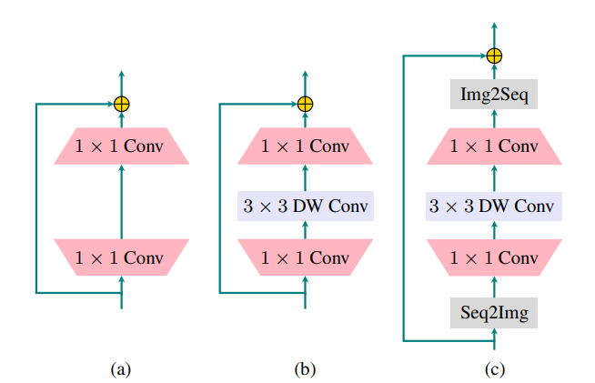

# LocalViT: Bringing Locality to Vision Transformers
This repo implements [LocalViT: Bringing Locality to Vision Transformers](https://arxiv.org/abs/2104.05707) paper using pytorch and this is not the official implementation, for official implementation please visit [here](https://github.com/ofsoundof/LocalViT)

## Usage :
```python
import torch
from localvit import LocalViT

img = torch.ones([1, 3, 224, 224])
    
model = LocalViT(image_size = 224, patch_size = 16, num_classes = 100)
out = model(img)

print("Shape of out :", out.shape)      # [B, num_classes]
```
## Citation:
```
@misc{li2021localvit,
      title={LocalViT: Bringing Locality to Vision Transformers}, 
      author={Yawei Li and Kai Zhang and Jiezhang Cao and Radu Timofte and Luc Van Gool},
      year={2021},
      eprint={2104.05707},
      archivePrefix={arXiv},
      primaryClass={cs.CV}
}
```
